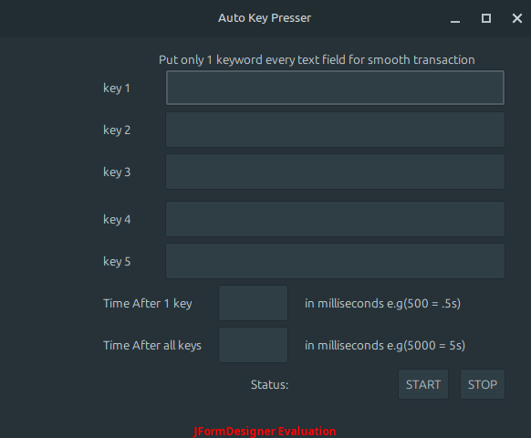

# AutoKeyPresser

A simple, cross-platform Java Swing utility to automate key pressing — originally created to support game development (**AQW**), but handy for any repetitive input tasks.

Screenshot of the GUI using my linux mint distro:



---

## Features

- 🖱 **Graphical Interface** — No need to deal with command-line automation tools.
- ⌨ **Custom Key Bindings** — Choose exactly which keys to press.
- ⏱ **Custom Delay Intervals** — Set precise time gaps between key presses.
- 🔁 **Repeat Function** — Automatically loop the sequence until stopped.
- 💻 **Cross-Platform** — Works on Windows, macOS, and Linux.
- 🎮 **Game-Friendly** — Originally built for AQW, but works with any application.
- ⚙ **Lightweight & Portable** — Just one `.jar` file, no installation required.

---

## Requirements

Before running AutoKeyPresser, you must have **Java JDK** installed.

### Install Java JDK

#### Windows & macOS
1. Download Java JDK from [Oracle JDK Downloads](https://www.oracle.com/java/technologies/javase-downloads.html) or [Adoptium](https://adoptium.net/).
2. Install it following the on-screen instructions.
3. Verify installation:
   ```bash
   java -version
   ```

#### Linux (Debian/Ubuntu-based)
```bash

sudo apt update
sudo apt install default-jdk
java -version
```

#### Linux (Fedora/RHEL-based)
```bash
sudo dnf install java-17-openjdk
java -version
```
---

## Grab the `.jar` and Run It

**Use the JAR file directly — no installer needed.**

### Steps:

1. **Download** `AutoKeyPresser.jar`
   - If you just cloned or downloaded this repository, the file is already in the project root.
   - Or you can [download it directly here](https://github.com/james-paul25/AutoKeyPresser/raw/main/AutoKeyPresser.jar).


2. **Install Java (JDK 17+)**  
   You must have Java installed before running:

   - **Windows/macOS/Linux:**  
     Download and install the **official Oracle Java JDK 17** from:  
     [https://www.oracle.com/java/technologies/javase/jdk17-archive-downloads.html](https://www.oracle.com/java/technologies/javase/jdk17-archive-downloads.html)

   - **Linux (Alternative via package manager):**
     ```bash
     sudo apt update
     sudo apt install openjdk-17-jre
     ```
   - **macOS:**
     ```bash
      brew install temurin17  
   - **if you already install the java jdk**
       ```bash
        java -version
       ```
     
3. **Run the app**:
   - Double-click the `.jar` file (if `.jar` files are associated with Java)
   - Or run in terminal/command prompt:
     ```bash
     cd path/jar-file-downloaded/
     java -jar AutoKeyPresser.jar
     ```

---


## Platform Compatibility

- **Windows** — Tested on Windows 10/11
- **Linux** — Works on Ubuntu and other distributions
- **macOS** — Runs with Java installed; may require allowing the app in **System Preferences → Security**

---

## Customize It

This GUI lets you configure key sequences and timings — useful for game testing (like AQW) or automating repetitive keystrokes.  
You can also modify the code if your needs change.

---

## Background

I originally built this for automating sequences in **AQW** game development, but it can be useful for **any scenario** where you need repeated keystrokes — testing, forms, automation tools, etc.

---

## License

Licensed under the **MIT License** — feel free to use, modify, and redistribute.

---

## Contributions

- 💡 Have ideas or features to suggest? Open an **issue** or **PR**!

1. **Fork and Clone the Repository**:
   - Fork this repository on GitHub.
   - Clone your fork locally:
    ```bash
     git clone https://github.com/{your-usrname}/AutoKeyPresser.git
     cd AutoKeyPresser
     ```
2. **Install Java JDK 17+**:
   - Make sure Java JDK 17 or higher is installed. See the Requirements section.

3. **Build the Project (Optional)**:
   - If you want to build and test your changes locally:
   ```bash
     mkdir -p out
     javac -d out src/*.java
     jar cfm AutoKeyPresser.jar manifest.txt -C out .
     ```
4. **Make Your Changes**:
   - Modify or add features in the source code (src/ folder).
   - Test your changes by running the .jar file.

5. **Commit and Push**:
   ```bash
     git add .
     git commit -m "Describe your changes"
     git push origin <your-branch-name>
     ```
6. **Open a Pull Request**:

   - Go to your fork on GitHub.
   - Click Compare & pull request.
   - Describe your changes and submit the PR.

